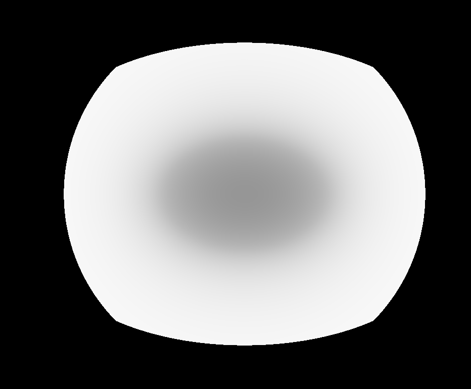

# Milestone1: Volumetric Self-Transfer for Real-Time Relighting

**Project:** Volumetric Precomputed Radiance Transfer (PRT)
**Date:** February 10, 2026

---

## 1. Project Overview
My project implements a **Volumetric Self-Transfer** system inspired by Sloan et al.’s *Precomputed Radiance Transfer (PRT)*. The goal is to achieve real-time relighting of participating media, specifically clouds or fog, under dynamic HDR environment maps. By decoupling light transport from the lighting environment, the expensive computation of volumetric self-shadowing is moved to an offline precomputation phase, enabling interactive lighting exploration at runtime.

## 2. Technical Implementation Progress

### 2.1 Ray Marching and Density Modeling (Completed)
I have implemented a GPU-based ray marcher within a fragment shader.
The volume is defined by an analytic ellipsoid Signed Distance Function (SDF) with an exponential falloff to simulate a realistic "fuzzy" boundary. Light attenuation is calculated via the Beer-Lambert Law.

### 2.2 Image-Based Lighting via Spherical Harmonics (Completed)
To represent the infinite lighting of an HDR environment map, I utilize **Spherical Harmonics (SH)**.
* **Projection:** HDR environment maps are projected into 3rd-order SH (9 coefficients) using an offline Python pipeline.
* **Runtime Reconstitution:** The shader reconstructs the lighting signal using SH basis functions implemented in GLSL, allowing for smooth, low-frequency global illumination without sampling the environment map directly per step.

HDR Environment Map 1 for wooden studio:

SH Projection 1:

HDR Environment Map 2 for meadow:

SH Projection 2:

### 2.3 Volumetric Self-Transfer & PRT Core (Completed)
The core of the project involves precomputing a **Transfer Function** $T(p, \omega)$ for every voxel in a $64^3$ grid.
* **Precomputation:** For each voxel, I sample 512 directions (Fibonacci sphere) and march rays outward to calculate self-occlusion. These results are projected into SH coefficients $T_{\text{SH}}(p)$.
* **Runtime Integration:** The radiance at a point $p$ is calculated as a dot product:
    $$L_{\text{inscatter}}(p) \approx \frac{1}{4\pi} \sum_i \frac{L_{\text{stored}}^{(i)}}{A_\ell} \cdot T_{\text{SH}}^{(i)}(p)$$
* **Kernel Un-baking:** I manually remove the Lambertian cosine kernel ($A_\ell$) from the lighting coefficients in the shader to ensure the math correctly reflects volumetric scattering rather than surface irradiance.

Self shadowing map:

**Simple PRT:**

Meadow:

Studio:

---

The system is currently fully interactive using **ImGui**. Any HDR-derived JSON file in the assets folder can be loaded at runtime to instantly change the lighting environment. I have also implemented debug modes to view the raw **Transfer DC** (self-shadow map) and **PRT Raw** (un-normalized) to verify the integrity of the 3D texture data.

---

## 4. Next Step: More realistic simulation and exploration

### 4.1 More realistic simulation
For the next phase, I plan to move beyond simple spheres to create realistic cloud and fog shapes using procedural noise. This will "carve" high-frequency details into the volume while still using my precomputed transfer data to keep rendering fast. I also intend to upgrade the lighting from static images to EXR sequences (like a sunset time-lapse).

### 4.2 Quantitative & Qualitative Evaluation

In the final stage, I also want to evaluate the trade-offs between voxel resolution and memory overhead by comparing $32^3$, $64^3$, and $128^3$ transfer grids. I also plan to conduct an SH order analysis to determine if 9 coefficients are sufficient for "peaked" lighting, such as sunsets, or if higher-order representations are required to capture sharper directional shadows.
